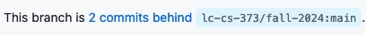

# Lexing in PLCC

The goal of this activity are:

* Ensure you have a working development environment for PLCC.
* Use PLCC to build scanners from a lexical specification in a grammar file.
* Ensure you can access your individual homework repository on GitHub.

## Setup

### Sync your repository

First make sure you you have the latest version of the class master repository.
Point your browser to your copy of the class master repository.  If it says near
the top left to screen that your repository is behind,



you should click on the `Sync fork` button near the right-hand side.


### Start Gitpod

Open your repository in Gitpod as we did in the
[previous](../../notes/note-02.md) lecture and as summarized in our
[cheat sheet](../../cheatsheet.md).

Test your setup by entering the following command in Virtual Studo Code's
terminal:

```bash
plcc --version
```

You should see the version number of PLCC, and not an error.

## Compiling and running a scanner interactively

`words.grammar` contains a lexical specification for a language.  Open it and
familiarize yourself with it.

Let's compile and run the scanner.

1. Open a terminal in your development environment (in Virtual Studio Code,
   `ctrl-shift-+`).
2. Position your command-line in the same directory as `words.grammar`, using
   the `cd` built-in command (do not type the $ in the examples. They represent
   the command prompt and are not entered by the user.)
   ```bash
   $ cd activities/03-lexing
   ```
3. Compile the grammar.
   ```bash
   $ plccmk words.grammar
   ```
4. Run the scanner.  The scanner reads from standard input, which is the
   keyboard by default.  So after you start the scanner, type some words on two
   or three lines and observe the scanner's output.  Each time you press enter,
   the scanner scans the line and prints the tokens it recognizes.
   ```bash
   $ scan
   type some words
       1: WORD 'type'
       1: WORD 'some'
       1: WORD 'words'
   more word
       2: WORD 'more'
       2: WORD 'word'
   ```
   When you have had enough, press `ctrl-d` to send an EOF (end of file)
   character, or press `ctrl-c` to send a terminate signal.

Repeat the above, but this time enter some characters that the scanner will not
recognize and see what it does.

## Running a scanner on a file

More often we want to run our scanner on the contents of a file.  Let's run our
scanner on `program1.words`.  This file represents a program written in our new
`words` language.  We have already built the scanner in the last section. So we
just need to run our scanner and redirect standard input to the contents of
`program1.words`.  We do this using `<` followed by the file name.

```bash
$ scan < program1.words
```

Try the last command to see that it works.

Write `program2.words`.  Put some invalid "tokens" in it and scan it.

## Glance under the hood

Take a look at the files in the `Java` directory.  Open `Token.java` and find
the definitions of the tokens from `words.grammar`.

`Scan.java` is the scanner.  This is what you have been interacting with when
you ran `scan`. In fact, `scan` is a script that runs the compiled `Scan.class`
as follows

```bash
$ java -cp Java Scan
```

Try the above command and confirm that it behaves just as `scan` did.

## Exercise

Add a `NUMBER` token to `words.grammar` that matches non-negative integers like

```
0
56
234
```

Recompile the grammar. It's always a good idea to delete the Java folder before
you do.

```bash
$ rm -rf Java
```

This ensures that you always get the latest versions of all the Java and `class`
files.

Now run your new scanner on `program1.words` to ensure it still works, and that
`program2.words` still fails.

Now create `program3.words` that uses your new token, and make sure it works.
